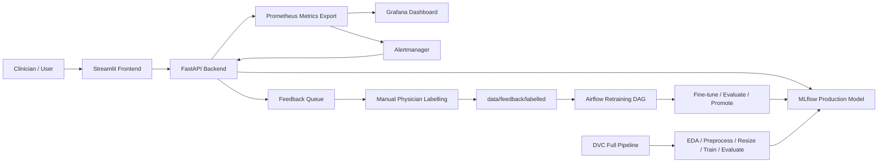
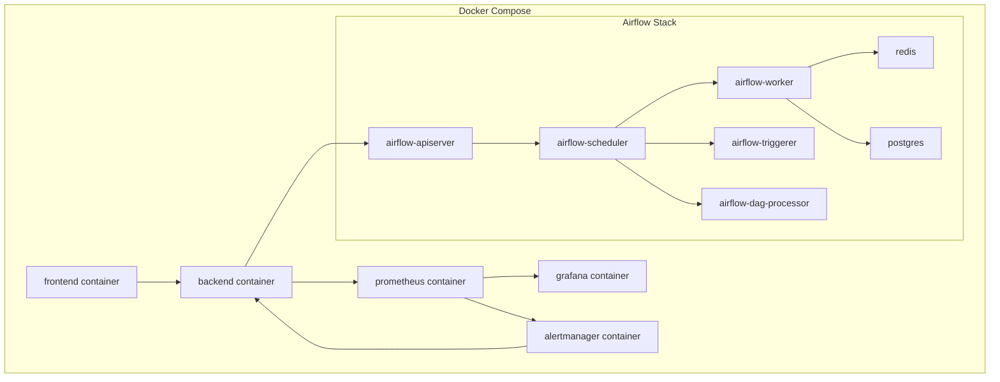
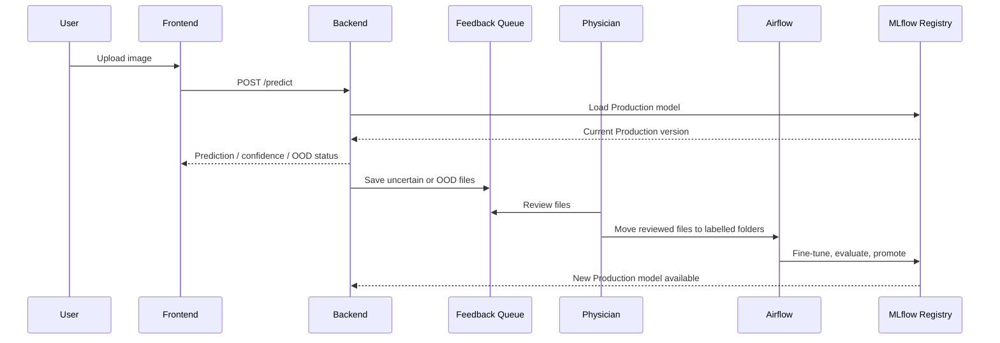

# Architecture Diagram

## System Overview

```mermaid
flowchart LR
    user["Clinician / User"] --> fe["Streamlit Frontend"]
    fe --> api["FastAPI Backend"]
    api --> model["MLflow Production Model"]
    api --> feedback["Feedback Queue"]
    api --> prom["Prometheus Metrics Export"]
    prom --> grafana["Grafana Dashboard"]
    prom --> alert["Alertmanager"]
    alert --> api
    feedback --> label["Manual Physician Labelling"]
    label --> labelled["data/feedback/labelled"]
    labelled --> airflow["Airflow Retraining DAG"]
    airflow --> finetune["Fine-tune / Evaluate / Promote"]
    finetune --> model
    dvc["DVC Full Pipeline"] --> preprocess["EDA / Preprocess / Resize / Train / Evaluate"]
    preprocess --> model
```

## Deployment View

```mermaid
flowchart TB
    subgraph Docker Compose
        fe["frontend container"]
        api["backend container"]
        prom["prometheus container"]
        grafana["grafana container"]
        alert["alertmanager container"]
        subgraph Airflow Stack
            api_server["airflow-apiserver"]
            scheduler["airflow-scheduler"]
            worker["airflow-worker"]
            triggerer["airflow-triggerer"]
            dag_proc["airflow-dag-processor"]
            redis["redis"]
            postgres["postgres"]
        end
    end

    fe --> api
    api --> prom
    prom --> grafana
    prom --> alert
    alert --> api
    api --> api_server
    api_server --> scheduler
    scheduler --> worker
    scheduler --> triggerer
    scheduler --> dag_proc
    worker --> redis
    worker --> postgres
```

## Feedback Loop

```mermaid
sequenceDiagram
    participant U as User
    participant F as Frontend
    participant B as Backend
    participant Q as Feedback Queue
    participant P as Physician
    participant A as Airflow
    participant M as MLflow Registry

    U->>F: Upload image
    F->>B: POST /predict
    B->>M: Load Production model
    M-->>B: Current Production version
    B-->>F: Prediction / confidence / OOD status
    B->>Q: Save uncertain or OOD files
    P->>Q: Review files
    P->>A: Move reviewed files to labelled folders
    A->>M: Fine-tune, evaluate, promote
    M-->>B: New Production model available
```

