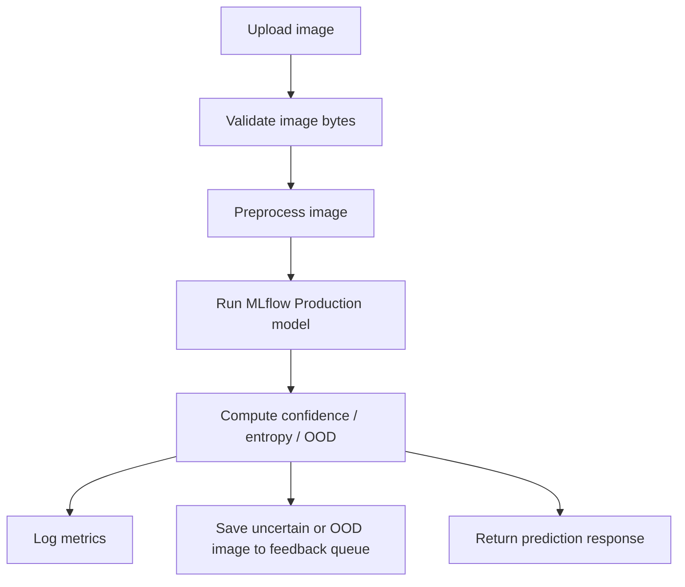

# Low-Level Design

## Primary API Endpoints

| Endpoint | Method | Purpose | Input | Output |
|---|---|---|---|---|
| `/health` | `GET` | Liveness check | None | `{status: "ok"}` |
| `/ready` | `GET` | Readiness check | None | `{ready: true}` |
| `/predict` | `POST` | Run inference on one image | multipart/form-data `{ file: binary }` | `{ prediction_label: string, confidence: float, entropy: float, is_ood: bool, low_confidence: bool }` |
| `/api/metrics` | `GET` | Fetch live UI metrics | None | totals, average confidence, low-confidence rate, OOD rate |
| `/api/failures` | `GET` | Read failure / review queue log | optional `limit`, `type` | recent failure entries |
| `/api/feedback/stats` | `GET` | Show queue sizes for manual annotation | None | counts for unlabeled, OOD, and labelled folders |
| `/pipeline/status` | `GET` | Show DVC workspace status | None | DVC status output and recommended command |
| `/retrain` | `POST` | Run full `dvc repro` pipeline | None | status plus stdout/stderr |
| `/api/retraining/status` | `GET` | Show latest Airflow DAG run and tasks | None | latest run, recent runs, task states |
| `/api/retraining/trigger` | `POST` | Manually trigger Airflow retraining DAG | optional conf payload | DAG run id and state |
| `/model/info` | `GET` | Show production model metadata | None | model version, run id, accuracy, F1 |
| `/alerts` | `GET` | Read current active alerts | None | list of active alerts |
| `/internal/alert` | `POST` | Alertmanager webhook sink | alert payload | acknowledgement |

## Inference Flow



## Feedback Labelling Structure

```text
data/feedback/
├── unlabeled/
├── unlabeled_ood/
└── labelled/
    ├── Parasitized/
    └── Uninfected/
```

## DVC Pipeline Stages

1. `merge_feedback`
2. `eda`
3. `preprocess`
4. `resize`
5. `train`
6. `evaluate`

## Airflow Feedback DAG Tasks

1. `check_new_images`
2. `process_feedback`
3. `finetune_model`
4. `evaluate_finetune`
5. `promote_model`
6. `dvc_snapshot`


### Error Handling

- 400 — invalid or unreadable image, empty file
- 422 — unsupported file type (if validation enabled)
- 503 — model not loaded
- 500 — unexpected internal error

### Example Request/Response

POST /predict

Request:
multipart/form-data
file: image/png

Response:
{
  "prediction_label": "Parasitized",
  "confidence": 0.91,
  "entropy": 0.32,
  "is_ood": false,
  "low_confidence": false
}